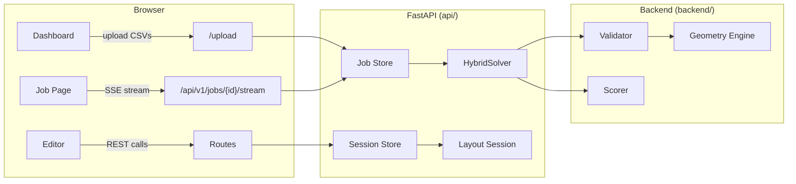

# Mecalux Layout Optimizer — Project Overview

> **HackUPC 2026** · Full-stack warehouse storage optimization  
> **Stack:** Python 3.10+ · FastAPI · Jinja2 · Vanilla JS/SVG  
> **License:** Hackathon project

---

## Table of Contents

1. [Architecture](#1-architecture)
2. [Directory Structure](#2-directory-structure)
3. [Backend — `backend/`](#3-backend)
4. [API Layer — `api/`](#4-api-layer)
5. [Frontend — Templates](#5-frontend)
6. [Data Flow](#6-data-flow)
7. [Configuration Reference](#7-configuration-reference)
8. [Testing](#8-testing)
9. [Deployment](#9-deployment)

---

## 1. Architecture



**Three-tier design:**

| Tier | Directory | Responsibility |
|------|-----------|----------------|
| **Backend** | `backend/` | Pure Python solver, models, geometry, validation, scoring. No web dependencies. |
| **API** | `api/` | FastAPI server, Pydantic models, session management, CSV parsing, bridge to backend. |
| **Frontend** | `api/templates/` | Jinja2 HTML templates with inline JS/CSS. Dark-mode SVG editor. |

---

## 2. Directory Structure

```
HackUPC_2026/
├── backend/                    # Pure Python optimization engine
│   ├── config.py               # Solver tunable constants
│   ├── main.py                 # CLI entry point (standalone usage)
│   ├── benchmark.py            # Multi-case benchmark runner
│   ├── models/                 # Domain data models (dataclasses)
│   │   ├── __init__.py
│   │   ├── bay_type.py         # BayType: id, width, depth, height, gap, n_loads, price
│   │   ├── warehouse.py        # Warehouse polygon (Point, Warehouse)
│   │   ├── obstacle.py         # Axis-aligned rectangular obstacle
│   │   ├── ceiling.py          # CeilingProfile: piecewise-constant height
│   │   ├── case_data.py        # CaseData: aggregates all input
│   │   └── solution.py         # PlacedBay, Solution (CSV I/O)
│   ├── geometry/               # Computational geometry primitives
│   │   ├── __init__.py
│   │   ├── polygon.py          # Point-in-polygon, rect containment (integer coords)
│   │   ├── obb.py              # SAT overlap, rotated-rect-in-polygon (float coords)
│   │   └── spatial.py          # Utility re-exports
│   ├── solver/                 # Optimization algorithms
│   │   ├── __init__.py
│   │   ├── base.py             # BaseSolver abstract interface
│   │   ├── hybrid.py           # HybridSolver: main 5-phase solver (1198 lines)
│   │   ├── layout.py           # PlacementTemplate, PlacedFootprint, LayoutState, scoring
│   │   ├── spatial_hash.py     # SpatialHash: uniform grid for O(1) collision queries
│   │   └── greedy.py           # Legacy greedy stub (unused)
│   ├── validation/             # Constraint checking
│   │   ├── __init__.py
│   │   ├── rules.py            # CaseContext, placement_violations(), is_valid_placement()
│   │   └── validator.py        # validate_solution(): full solution check
│   ├── scoring/                # Q-score computation
│   │   ├── __init__.py
│   │   └── scorer.py           # compute_score(solution, case) → float
│   ├── visualization/          # ASCII art renderer (CLI debugging)
│   │   └── __init__.py         # render_ascii(case, solution, width, height)
│   ├── parsers/                # File-based CSV ingestion
│   │   ├── __init__.py
│   │   └── csv_parser.py       # parse_warehouse, parse_obstacles, etc. + load_case()
│   └── tests/                  # Unit tests
│
├── api/                        # FastAPI web application
│   ├── main.py                 # App factory, lifespan, page routes ("/", "/jobs", "/editor")
│   ├── routes.py               # API router: /api/v1/* (optimize, layout CRUD, jobs, testcases)
│   ├── api_models.py           # Pydantic request/response models
│   ├── api_config.py           # API-specific constants (version, timeouts)
│   ├── bridge.py               # Converts API models ↔ backend dataclasses
│   ├── csv_parser.py           # Parses CSV strings → OptimizationInput (web uploads)
│   ├── scorer.py               # Delegates to backend scorer/validator
│   ├── layout_session.py       # StatefulLayoutSession: in-memory live editing
│   ├── session_store.py        # LayoutSessionStore: session lifecycle + expiry
│   ├── job_store.py            # In-memory job registry + SSE progress queues
│   ├── templates/              # Jinja2 HTML pages
│   │   ├── base.html           # Shared <head> (fonts, Tailwind CDN)
│   │   ├── dashboard.html      # File upload page (drag-and-drop, dark theme)
│   │   ├── job.html            # Optimization progress page (SSE stream)
│   │   └── editor.html         # Interactive SVG layout editor (900+ lines)
│   ├── static/css/styles.css   # Dashboard-specific CSS
│   ├── requirements.txt        # fastapi, uvicorn, python-multipart, jinja2
│   └── Dockerfile              # Container definition
│
├── testcases/                  # Challenge test data
│   ├── Case0/                  # L-shaped warehouse (10000×10000, cutout)
│   ├── Case1/                  # Simple rectangular
│   ├── Case2/                  # Complex polygon
│   └── Case3/                  # Large multi-obstacle
│       └── {warehouse,obstacles,ceiling,types_of_bays}.csv
│
├── README.md                   # Quick-start guide
├── algorithm_deep_dive.md      # Detailed algorithm documentation
└── DOCUMENTATION.md            # Legacy documentation
```

---

## 3. Backend

### 3.1 Models (`backend/models/`)

All models use `@dataclass(frozen=True, slots=True)` for immutability and memory efficiency.

| Model | File | Key Fields | Purpose |
|-------|------|------------|---------|
| `Point` | `warehouse.py` | `x: int`, `y: int` | 2D coordinate (mm) |
| `Warehouse` | `warehouse.py` | `vertices: list[Point]` | Boundary polygon. Properties: `area` (Shoelace), `bounding_box`, `vertex_tuples`. |
| `Obstacle` | `obstacle.py` | `x, y, width, depth: int` | Axis-aligned rectangle inside warehouse |
| `CeilingProfile` | `ceiling.py` | `breakpoints: list[tuple[int,int]]` | Piecewise-constant height. Methods: `height_at(x)`, `min_height_in_range(x_start, x_end)`. |
| `BayType` | `bay_type.py` | `id, width, depth, height, gap, n_loads, price` | Bay catalog entry. Property: `area → width × depth`. |
| `CaseData` | `case_data.py` | `warehouse, obstacles, ceiling, bay_types` | Aggregates all input. Property: `bay_type_map → dict[int, BayType]`. |
| `PlacedBay` | `solution.py` | `bay_type_id, x, y, rotation: float` | Single placement. Methods: `corners()`, `gap_zone()`, `aabb()`. |
| `Solution` | `solution.py` | `placements: list[PlacedBay]` | Complete layout. I/O: `to_csv()`, `from_csv()`. |

### 3.2 Geometry Engine (`backend/geometry/`)

| Function | File | Description |
|----------|------|-------------|
| `polygon_area(vertices)` | `polygon.py` | Shoelace formula, integer coordinates |
| `point_in_polygon(px, py, vertices)` | `polygon.py` | Ray-casting + boundary check (integer) |
| `rect_inside_polygon(...)` | `polygon.py` | AABB containment via corner + edge-crossing checks |
| `convex_polygons_overlap(poly1, poly2)` | `obb.py` | SAT test for convex polygons (float) — boundary touch = no overlap |
| `rotated_rect_inside_polygon(corners, poly)` | `obb.py` | All corners inside + no edge crossing (float) |
| `segments_intersect_strict(p1,p2,p3,p4)` | `obb.py` | Strict segment crossing (no endpoint touching) |

### 3.3 Solver (`backend/solver/`)

#### `PlacementTemplate` (layout.py)
Precalculated rotation geometry for a `(BayType, angle)` pair. Cached fields: `body_local`, `gap_local`, AABBs, feature offsets. Method: `place(x, y) → PlacedFootprint`.

#### `PlacedFootprint` (layout.py)
Translated placement with world-coordinate polygons, AABBs, and x-span. Immutable (`frozen=True`).

#### `LayoutState` (layout.py)
Mutable solver state: footprints list, row bundles, two `SpatialHash` instances (`body_hash`, `gap_hash`), running totals (`total_area`, `total_price`, `total_loads`). Property: `score → Q value`. Method: `with_candidate(row) → new state`.

#### `score_from_totals(area, price, loads, warehouse_area) → float` (layout.py)
```python
Q = (price / loads) ** (2.0 - area / warehouse_area)
```

#### `SpatialHash` (spatial_hash.py)
Uniform grid spatial index. Methods: `add(aabb, id)`, `remove(aabb, id)`, `query(aabb) → set[int]`, `copy()`. Cell size = `max(depth) + max(gap)`.

#### `HybridSolver` (hybrid.py) — 1198 lines
Five-phase pipeline. See [algorithm_deep_dive.md](algorithm_deep_dive.md) for full details.

| Phase | Method | Budget | Strategy |
|-------|--------|--------|----------|
| 1. Axis Sweep | `_solve_axis_sweep()` | 35% | Cardinal-direction greedy scan |
| 2. Beam Search | `_construct_incumbent()` | Remaining | Row-bundle beam search (width=6) |
| 3. Exact B&B | `_solve_exact_branch_and_bound()` | 70% | DFS with optimistic pruning |
| 4. Refinement | `_refine_solution()` | Remaining | Row replacement + filler rows |
| 5. Gap Fill | `_fill_gaps()` | Remaining | Individual bay greedy placement |

### 3.4 Validation (`backend/validation/`)

#### `CaseContext` (rules.py)
Precalculated case geometry: warehouse polygon, obstacle polygons, free rectangles, reference points, spatial-hash cell size.

#### `placement_violations(footprint, ctx, existing, state, ...) → list[str]` (rules.py)
Checks 5 constraints: (1) body inside warehouse, (2) gap inside warehouse, (3) height ≤ ceiling, (4) no obstacle overlap, (5) no bay-bay body/gap overlap. Uses spatial hash for fast neighbor lookup.

#### `validate_solution(solution, case) → ValidationResult` (validator.py)
Validates every placement in sequence, building spatial state incrementally.

### 3.5 Scoring (`backend/scoring/scorer.py`)
`compute_score(solution, case) → float` — Computes Q by summing area/price/loads across all placed bays.

### 3.6 CLI (`backend/main.py`)
Standalone entry point: `python main.py <case_dir> [--time-budget S] [--output FILE] [--json FILE]`. Runs: Load → Solve → Validate → Score → ASCII viz → CSV output.

---

## 4. API Layer

### 4.1 Application (`api/main.py`)

FastAPI app with:
- **Lifespan**: starts/stops the session-store expiry sweep
- **CORS**: allows all origins (hackathon)
- **Page routes**: `GET /` (dashboard), `GET /jobs/{id}`, `GET /editor/{session_id}`
- **Upload handler**: `POST /upload` → parse CSVs → create job → redirect to job page

### 4.2 API Endpoints (`api/routes.py`)

| Method | Path | Description |
|--------|------|-------------|
| `GET` | `/api/v1/health` | Health check (`{status, version}`) |
| `POST` | `/api/v1/optimise` | JSON input → solve → live session |
| `POST` | `/api/v1/optimise/files` | CSV uploads → solve → live session |
| `PATCH` | `/api/v1/layout/move` | Move a bay in a session |
| `PATCH` | `/api/v1/layout/rotate` | Rotate a bay (snapped to 30°) |
| `PATCH` | `/api/v1/layout/delete` | Delete a bay |
| `POST` | `/api/v1/layout/suggest` | AI-suggest best bay placement |
| `POST` | `/api/v1/layout/add` | Manual bay placement at (x,y) |
| `GET` | `/api/v1/layout/{id}` | Get current layout snapshot |
| `POST` | `/api/v1/solve` | Legacy: CSV upload → background job |
| `POST` | `/api/v1/solve/json` | Legacy: JSON → background job |
| `GET` | `/api/v1/jobs` | List all jobs |
| `GET` | `/api/v1/jobs/{id}` | Get job status |
| `GET` | `/api/v1/jobs/{id}/result` | Get completed job result |
| `POST` | `/api/v1/jobs/{id}/cancel` | Cancel a job |
| `GET` | `/api/v1/jobs/{id}/stream` | SSE progress stream |
| `POST` | `/api/v1/score` | Legacy score endpoint |
| `POST` | `/api/v1/validate` | Legacy validation endpoint |
| `GET` | `/api/v1/testcases` | List available test cases |
| `GET` | `/api/v1/testcases/{name}` | Load a test case |
| `GET` | `/api/v1/session/{id}/case` | Get case data for a session |

### 4.3 Pydantic Models (`api/api_models.py`)

| Model | Fields | Used By |
|-------|--------|---------|
| `BayType` | id, width, depth, height, gap, nLoads, price | Input |
| `Obstacle` | x, y, width, depth | Input |
| `CeilingPoint` | x, height | Input |
| `WallPoint` | x, y | Input |
| `OptimizationInput` | warehouse, obstacles, ceiling, bay_types | `POST /optimise` |
| `LayoutBay` | instance_id, bay_type_id, x, y, rotation, valid, issues | Response |
| `LayoutResponse` | session_id, valid, Q, coverage, bay_count, total_loads, bays, ... | All layout ops |
| `MoveBayRequest` | session_id, bay_id, x, y | `PATCH /layout/move` |
| `RotateBayRequest` | session_id, bay_id, rotation | `PATCH /layout/rotate` |
| `DeleteBayRequest` | session_id, bay_id | `PATCH /layout/delete` |
| `SuggestBayRequest` | session_id | `POST /layout/suggest` |
| `AddBayRequest` | session_id, bay_type_id, x, y, rotation | `POST /layout/add` |
| `Job` | id, status, progress, input_data, result, error | Background jobs |

### 4.4 Live Session (`api/layout_session.py`)

`StatefulLayoutSession` — In-memory layout state with incremental updates:

- **Spatial hashes** (`_body_hash`, `_gap_hash`) for O(1) collision queries
- **Slot array** (`_slots: list[SessionBay | None]`) with tombstone deletion
- **Running totals** (`total_area`, `total_price`, `total_loads`) updated on every operation
- **Operations**: `move_bay()`, `rotate_bay()`, `delete_bay()`, `add_bay()`, `suggest_bay()`
- **Validation**: only revalidates the **affected neighborhood** (bays whose AABBs overlap the changed region)
- **Performance**: all operations < 5ms for typical layouts

### 4.5 Session Store (`api/session_store.py`)

`LayoutSessionStore` — Process-wide singleton (`get_layout_session_store()`):
- Async lock-protected dict of sessions
- Background task sweeps expired sessions every 60s (TTL: 30 min)
- Touch-on-access keeps active sessions alive

### 4.6 Bridge (`api/bridge.py`)

Converts between Pydantic API models and stdlib-dataclass backend models:
- `to_case_data(OptimizationInput) → CaseData`
- `dicts_to_case_data(dicts...) → CaseData`
- `dicts_to_solution(placed_bays) → Solution`
- `solution_to_api(solution, case, elapsed) → SolveResult`

---

## 5. Frontend

### 5.1 Dashboard (`dashboard.html`)
Dark-themed file upload page. Drag-and-drop zone with auto-detection (matches filenames to warehouse/obstacles/ceiling/bay_types). Requires all 4 files. "START" button submits to `POST /upload`.

### 5.2 Job Page (`job.html`)
SSE-connected progress page. Amber progress bar. Auto-redirects to editor on completion.

### 5.3 Editor (`editor.html`)
Full interactive SVG layout editor (900+ lines):
- **SVG canvas** with warehouse boundary, obstacles, gap zones, bay rectangles, labels
- **Sidebar**: testcase selector, optimize button, metrics (Q, bays, loads, coverage, selected bay)
- **Bay operations**: click-to-select, drag-to-move, rotate (+30°), delete, suggest, manual placement
- **Manual placement**: select bay type → click "Place on layout" → crosshair cursor → click on canvas
- **Keyboard**: `R` = rotate, `Delete` = delete, `Escape` = cancel placement mode
- **Real-time updates**: every operation calls the API and re-renders the SVG

---

## 6. Data Flow

### 6.1 Optimization Flow
```
User uploads 4 CSVs → POST /upload
  → parse_all() → OptimizationInput
  → create Job → redirect to /jobs/{id}
  → Background: to_case_data() → HybridSolver.solve() → Solution
  → StatefulLayoutSession.from_solution() → save to store
  → SSE: job_completed → redirect to /editor/{session_id}
```

### 6.2 Live Edit Flow
```
User clicks bay → state.selectedBayId = id
User drags → PATCH /layout/move {session_id, bay_id, x, y}
  → session.move_bay() → _replace_footprint() → _refresh_validity(neighbors)
  → snapshot() → LayoutResponse (Q, validity, all bays)
  → Frontend re-renders SVG
```

### 6.3 Manual Placement Flow
```
User selects bay type → clicks "Place on layout" → crosshair mode
User clicks on SVG → svgPoint(event) → (x, y) in warehouse coords
  → POST /layout/add {session_id, bay_type_id, x, y, rotation: 0}
  → session.add_bay() → _insert_new_bay() → _refresh_validity(all)
  → snapshot() → LayoutResponse → re-render
```

---

## 7. Configuration Reference

### Backend (`backend/config.py`)

| Constant | Value | Description |
|----------|-------|-------------|
| `ANGLE_STEP_DEGREES` | 30.0 | Rotation lattice step |
| `DEFAULT_TIME_BUDGET_SECONDS` | 15.0 | Solver wall-clock budget |
| `DEFAULT_BEAM_WIDTH` | 6 | Beam search width |
| `DEFAULT_CANDIDATE_LIMIT` | 12 | Max candidates per iteration |
| `MAX_ROW_SLOTS` | 2048 | Max bays per row |
| `EXACT_NODE_LIMIT` | 3000 | B&B node cap |
| `EXACT_REFERENCE_POINT_LIMIT` | 150 | Skip exact if exceeded |
| `EXACT_TIME_FRACTION` | 0.70 | Budget fraction for exact |
| `REFINEMENT_TIME_FRACTION` | 0.20 | Budget fraction per refine pass |
| `FLOAT_TOLERANCE` | 1e-9 | Numerical comparison epsilon |

### API (`api/api_config.py`)

| Constant | Value | Description |
|----------|-------|-------------|
| `API_VERSION` | "2.1.0" | Reported in `/health` |
| `DEFAULT_SOLVER_TIME_BUDGET_SECONDS` | 15.0 | Passed to solver |
| `SESSION_EXPIRY_SECONDS` | 1800 | Session TTL (30 min) |
| `SESSION_SWEEP_SECONDS` | 60 | Cleanup interval |

---

## 8. Testing

| File | Scope |
|------|-------|
| `api/test_api.py` | API route smoke tests |
| `api/test_boot.py` | FastAPI app instantiation |
| `api/test_integration.py` | End-to-end: upload → optimize → edit |
| `api/smoke_test.py` | Quick health check |
| `backend/tests/` | Backend unit tests |

---

## 9. Deployment

### Local Development
```bash
# Install dependencies
pip install -r api/requirements.txt

# Start server
uvicorn main:app --app-dir api --host 0.0.0.0 --port 8000

# Open browser
# → http://127.0.0.1:8000/
```

### Docker
```dockerfile
# api/Dockerfile
FROM python:3.11-slim
WORKDIR /app
COPY . .
RUN pip install -r api/requirements.txt
CMD ["uvicorn", "main:app", "--app-dir", "api", "--host", "0.0.0.0", "--port", "8000"]
```

### CLI (Backend Only)
```bash
cd backend
python main.py ../testcases/Case0 --time-budget 15 --json result.json
```

### Requirements
- **Python**: 3.10+ (uses `dataclass(slots=True)` and `X | Y` union syntax)
- **Dependencies**: `fastapi`, `uvicorn`, `python-multipart`, `jinja2`
- **No external solver libraries** — pure Python implementation
